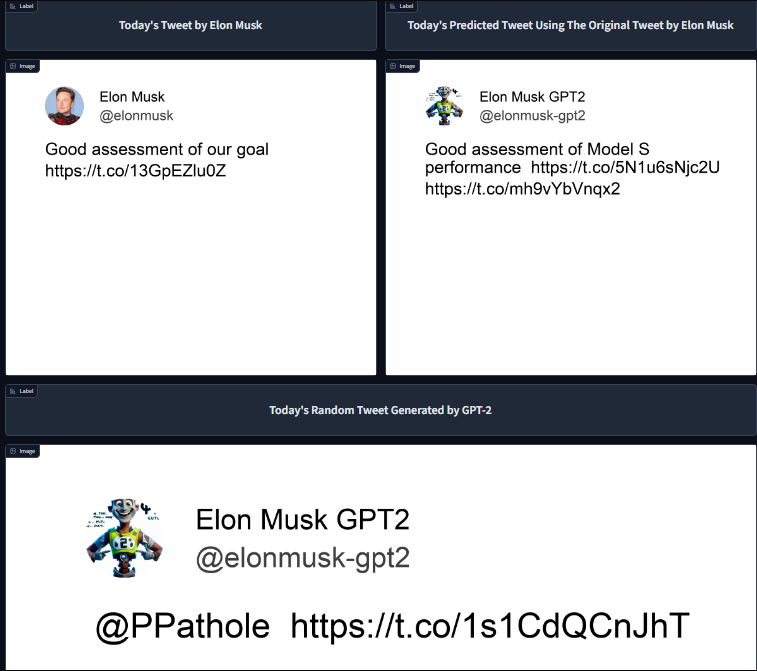

# ElonMuskTweetPredictor
# Introduction - Using GPT-2 to generate tweets similar to Elon Musk
A project where we build a Machine Learning application in scale. The purpose of this project is to learn how to use different platforms and incorporate them into a ML app. We use platforms such as Hopsworks (visit https://www.hopsworks.ai/), Modal (visit https://modal.com/), and Huggingface (visit https://huggingface.co/). 

Our machine learning application will try to fine tune a GPT-2 model for a text generation task. In short, we will fine tune a GPT-2 model to be able to generate tweets similar to Elon Musk's tweets. We will use historical data found in (https://www.kaggle.com/datasets/ayhmrba/elon-musk-tweets-2010-2021) and we will also use live data by using the Twitter API. The results will be shown in an app, where we will showcase some images of the tweets generated by our model aswell as the original tweet that has been scraped from Twitter.

In this repository you will find both notebooks and python scripts. The purpose of this is to use the notebook as "tutorials" while the scripts do not include much text but can be used quickly.

# Step 1 - Handling historical data

As previously mentioned, we got our historical data from https://www.kaggle.com/datasets/ayhmrba/elon-musk-tweets-2010-2021. The files from this website can be found in the folder "Uncleaned Elon Data".

In the notebook CleanElonTweetDataNotebook.ipynb, a step by step "tutorial" is done so that you can get an intuiton of what was done when cleaning the data. If you do not want to use it you can look at the other notebook feature_engineering_scripts_notebook.ipynb. There I define two functions that do the same thing I did in the first notebook and then upload it to our feature store in Hopsworks

The script feature_engineering_script.py, is a script that uploads the data to Hopswork's feature store

# Step 2 - Finding live data.

For the second task, this project looks into using live data, to extend our dataset but also be used later for our machine learning application. For this, we were granted access to the Twitter API, which we then could use to scrape tweets and other relevant data. 

With the twitter API, we created a script that scrapes tweets and also process the data into a dataframe that suits our feature store from the previous step. 

By using the platform Modal (visit https://modal.com/), we can deploy our script online and specify in the script to scrape four tweets and insert them to our data storage in Hopsworks. This process can be found in the script modal_script.py'

The test_modal_script.py script, was used as an initial test when exploring how to deploy scripts to modal. It is a simple script that prints the data we have scraped from Twitter

# Step 3 - Fine Tuning a GPT-2 model for text generation/Huggingface
For our model, we will use a and fine tune an existing model. More specifically, we will make use of the transformers library and use the pre-trained GPT-2 model from Huggingface (visit https://huggingface.co/gpt2). This is the only step where a GPU is required, and therefore the script for this will only be in a Python notebook. See the notebook "train_model_pipeline.ipynb". You can use it in two different ways: (1) Upload the data locally, or (2), upload the data using Hopsworks. Depending on the hyperparameters, training usually takes around 15-20 minutes.

# Step 4 - Daily Predicition/Monitoring our results
To make use of our live data that we find in step 2, we created a script that will take the most recently inserted tweet, and use the first two words from that tweet to use as our prompt for our prediction. The prompt is inputed to our model and a tweet is generated by our model. For fun, we also create a totally random tweet by inputting an empty prompt to the model. The outputs and the original tweet, are then combined to create a new dataframed and uploaded to a new feature group called "em_gpt_monitor". This feature group will later be used for our app, to showcase the original tweet and the generated tweets. The script for this can be found in batch_inference_pipeline.py. This script runs once everyday and is deployed to Modal (as in step 2).

# Step 5 - UI using Huggingface
For the final step, we will use a Huggingface space to showcase our results (from step 4). We create a simple UI that shows three different images, one of the original tweet by Elon Musk that was scraped by our Modal app, one for the generated tweet that used the first two words from the original tweet, and finally, an image of a randomly generated tweet using an empty prompt as input. The images are created using a function that can be found in the gradioapp.ipynb notebook. It simply uses the images in the Image folder to create the Twitter icons, and uses the arial.ttf file to create the font. Make sure to upload them to the notebook or else you will recieve an error when running the code. 

The app can be found here https://huggingface.co/spaces/davidt123/Elon_Musk_Tweet_Generator_With_GPT-2 
!!!NOTE!!! Connection error that I am not sure how to solve (same issue in lab 1 - titanic app)

However, the app can be shown in the notebook gradioapp.ipynb and it works as it should!

# NOTE!!!!

To be able to use some of the scripts, you will need to have access to different API keys, such as four different keys from the Twitter API, an API key from Hopsworks,  an access token from Huggingface, and generate a token from Modal.

You will only need a GPU when fine tuning the model (Step 3). GPU is not needed for all the other steps.

